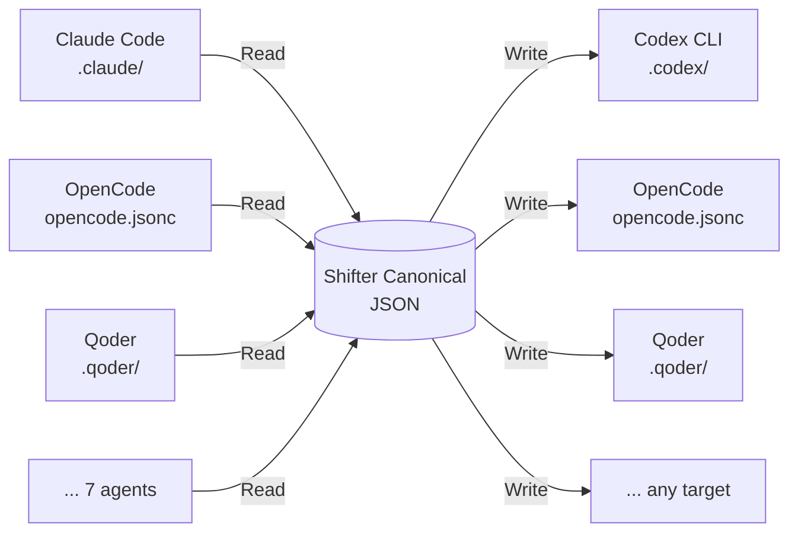
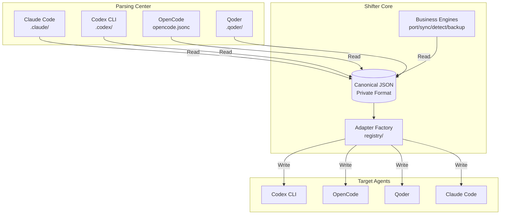

# 🔄 Shifter

[📖 中文文档](README.zh-CN.md)

<p align="center">
  <strong>One-click config porting between coding agent.</strong><br>
  Configure agents, skills, MCP servers, hooks once — use in Claude Code, Codex, OpenCode, Qoder, and more.
</p>

<p align="center">
  
  
  
  
</p>

---

## Installation

```bash
curl -fsSL https://raw.githubusercontent.com/Moximxxx/shifter/release/install.sh | sh
```

## Quick Start

```bash
shifter detect                              # scan configured agents
shifter port claude-code --to codex         # migrate config
shifter ui                                  # interactive wizard
```

Or with env defaults (no args needed):

```bash
export SHIFTER_SOURCE=claude-code
export SHIFTER_TARGET=codex
shifter port        # that's it
```

## What It Does



Read native config → universal canonical JSON → write to any target agent. Semantic mapping handles format gaps; incompatible features generate clear severity-leveled warnings.

## Features

|     | Feature | Description |
|:---:|---------|-------------|
| 🔀 | **Port** | Transfer config between agents: `shifter port claude-code --to codex --aspects agents,mcp` |
| 💾 | **Profiles** | Save/load reusable config templates: `shifter save team-setup --source claude-code` |
| 📤 | **Export/Import** | Canonical JSON as portable format: `shifter export claude-code \| shifter import - --to codex` |
| 🔄 | **Sync** | Bidirectional merge with strategies: `shifter sync claude-code codex --strategy newer` |
| 🎨 | **TUI Wizard** | Interactive guided workflow: `shifter ui` |
| ⚠️ | **Loss Tracking** | Every incompatible feature generates a clear severity-leveled warning |
| 💾 | **Auto-Backup** | Every write creates a timestamped tar.gz — undo anytime |

## Supported Agents

| Agent | Agents | Skills | MCP | Hooks | Format |
|-------|:---:|:---:|:---:|:---:|--------|
| **Claude Code** | ✓ | ✓ | ✓ | ✓ | JSON + MD |
| **Codex CLI** | ✓ | ✓ | ✓ | ✓ | TOML |
| **OpenCode** | ✓ | ✓ | ✓ | — | JSONC |
| **Qoder** | ✓ | ✓ | ✓ | — | MD frontmatter |
| **Gemini CLI** | — | — | ✓ | — | JSON |
| **Cline** | embed | — | — | — | Markdown |
| **Aider** | — | — | — | — | YAML |

> `embed` = content preserved as embedded instructions. Full capability matrix in the [Manual](MANUAL.md).

## Commands

```bash
shifter port      <src> --to <tgt>    # one-directional transfer
shifter export    <agent>             # export to canonical JSON
shifter import    <file> --to <tgt>   # import from canonical JSON
shifter sync      <a> <b>             # bidirectional sync
shifter save      <name> --source <a> # save config as profile
shifter load      <name> --to <b>     # apply saved profile
shifter detect                        # scan for configured agents
shifter status                        # show project status
shifter backup    <agent>             # create/restore backups
shifter profiles                      # manage saved profiles
shifter env                           # show environment config
shifter ui                            # interactive TUI wizard
```

## Architecture



Adding a new agent: implement `AgentAdapter` (Read + Write), register in `registry/`, done.

## Environment Variables

```bash
eval "$(shifter env init)"    # generate shell config

SHIFTER_SOURCE=claude-code    # default source agent
SHIFTER_TARGET=codex          # default target agent
SHIFTER_DRY_RUN=1             # always preview first
SHIFTER_ASPECTS=agents,mcp    # default aspect filter
```

[Full environment reference →](MANUAL.md#environment-variables)

## Manual

Full documentation with all commands, environment variables, config file locations, FAQ, and loss severity guide — **[Shifter Manual →](MANUAL.md)**

## Development

```bash
make build          # compile with version info
make test           # run all tests
make check          # fmt + vet + test + build
make release        # cross-compile all platforms
```

---

<p align="center">
  <sub>MIT · <a href="https://github.com/Moximxxx/shifter">GitHub</a> · <a href="https://github.com/Moximxxx/shifter/releases">Releases</a></sub>
</p>
